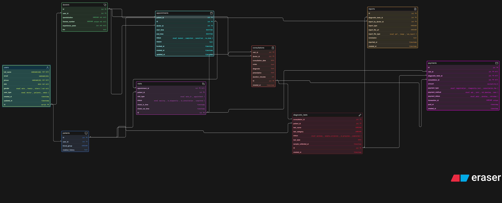

# Clinic Management System - Database Design

## What is this?

This is a database design for a **modern clinic management system** that handles patient appointments, doctor consultations, diagnostic tests, and payments digitally.

**9 Tables:**
1. users - Base table for all users (doctors, patients, admins)
2. doctors - Doctor profiles with specialization
3. patients - Patient medical records
4. appointments - Scheduled bookings with doctors
5. visits - Actual clinic visits (walk-in or appointment-based)
6. consultations - Doctor-patient consultation records
7. diagnostic_tests - Lab tests and scans prescribed
8. reports - Test results and findings
9. payments - Payment tracking for services

**How they connect:**
- Patients book appointments with doctors
- Appointments result in visits (or walk-ins create visits directly)
- Visits lead to consultations with doctors
- Doctors prescribe diagnostic tests during consultations
- Tests generate reports reviewed by doctors
- Payments link to visits, consultations, or diagnostic tests

**Key Features:**
- Supports both scheduled appointments and walk-ins
- Tracks complete patient journey from booking to report
- Flexible payment system for different service types
- Maintains doctor-patient relationship history
- Handles multiple tests per consultation

---

Created for: Clinic Management System Database Assignment